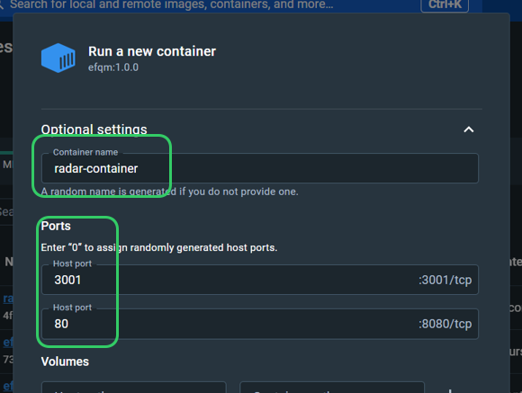

# System Deployment Guide

#### Organization Excellence Assessment Tool (RADAR)

## Table of Contents

- [Stack](#stack)
- [Requirements](#requirements)
  - [Server](#server)
  - [Network](#network)
  - [Clients](#clients)
- [Deployment](#deployment)
  - [1. Download & Install Docker](#1-download--install-docker)
  - [2. Download & Load Docker Image](#2-download--load-docker-image)
  - [3. Run the Docker Image](#3-run-the-docker-image)
  - [4. Set Automatic Start](#4-set-automatic-start)
  - [5. Expose Relevant Network Ports](#5-expose-relevant-network-ports)
  - [6. (Optional) Expose Local URL](#6-optional-expose-local-url)
  - [7. Share Access URL](#7-share-access-url)
- [Default Admin Credentials](#default-admin-credentials)
- [Administration & Usage Manuals](#administration--usage-manuals)

## Stack

1. Frontend: Web Application Interface (Vue.js + Vuetify)
2. Backend: Business Logic & Storage (Node.js)
3. Environment: Docker

## Requirements

### Server:

Requirements for the server hosting the Docker image are as follows:

|             | Minimum                                               | Recommended      |
| ----------- | ----------------------------------------------------- | ---------------- |
| **RAM**     | 2 GB                                                  | 4 GB             |
| **CPU**     | 64-bit processor                                      | 64-bit processor |
| **Storage** | 1 GB                                                  | 2 GB             |
| **OS**      | Any Docker supporting OS (e.g. Linux, Windows, MacOS) |

### Network:

- The docker image on the server will need access to the same LAN where the users are
- The solution will require exposing two network ports:
  - Backend: Port # 3001 (**Fixed**): This connects to the backend's API
  - Web Interface: Port # xxxx: This connects to the front-end web interface
    > Note: IT will decide which port to expose to users, but 80 is preferred to ease user access

### Clients:

- Modern web browser (Microsoft Edge, Google Chrome, Firefox)
- Network access to application server through ports above

## Deployment

### 1. Download & Install Docker

- [Download Docker Desktop](https://www.docker.com/products/docker-desktop/) from `docker.com` and install it

### 2. Download & Load Docker Image

1. Head to the solution package [here](https://netorgft5795324-my.sharepoint.com/:u:/g/personal/jack_tbc-me_com/EQLQMa5d6FJAqBy7QXSGd1QBDw89PdCU_50bGCro7BKFzA?e=sF2CQk), and download the file to your local machine (your server)
2. Load the Docker image to their local Docker environment using the following command:
   ```bash
   docker load -i path_to_your_tar/radar.tar
   ```

### 3. Run the Docker Image

When running the image, two ports need to be exposed:

- `3001` **which MUST stay mapped to `3001`** for the backend API
- `8080` which you can mape to any port of choice for web interface (Recommended: Port `80`)

To run the image use the following command:
`bash
	docker run -d --name radar-container -p 3001:3001 -p 8080:80 radar:1.0.0
	`

Or using the GUI:



### 4. Set Automatic Start

- Follow instructions in [Start containers automatically | Docker Documentation](https://docs.docker.com/config/containers/start-containers-automatically/); this is to ensure continues system availability for users.

### 5. Expose Relevant Network Ports

- Configure server's firewall to expose ports selected in step #3

### 6. (Optional) Expose Local URL

- If your network allows it, you can create a local DNS record pointing to the server:
  > Example: 192.168.x.x > radar.local

### 7. Share Access URL

- Notify target users with system's URL so they can start using it

## Default Admin Credentials

> Username: _`admin`_  
> Password: _`admin`_

## Administration & Usage Manuals

You can download all user manuals (zip file) through **[UserManuals.zip](manual/UserManuals.zip)** or view them online below:

| Manual                                                                                                              | For           |
| ------------------------------------------------------------------------------------------------------------------- | ------------- |
| **Administration**                                                                                                  |
| [How to Add a New User in Admin Panel](manual/Admin%20-%20How%20to%20Add%20a%20New%20User%20in%20Admin%20Panel.pdf) | `Admin`       |
| [How to Delete a Book](manual/Admin%20-%20How%20Delete%20a%20Book.pdf)                                              | `Admin`       |
| **Usage**                                                                                                           |
| [Change Theme & Interface](manual/All%20Users%20-%20Change%20Theme%20&%20Interface.pdf)                             | `All Users`   |
| [How to Enter Approach Data](manual/Contributor%20-%20How%20to%20Enter%20Approach%20Data.pdf)                       | `Contributor` |
| [Creating a New Book](manual/Assessor%20-%20Creating%20a%20New%20Book.pdf)                                          | `Assessor`    |
| [How to Enter Team Score](manual/Assessor%20-%20How%20to%20Enter%20Team%20Score.pdf)                                | `Assessor`    |
| [How to View Scoring Results](manual/All%20Users%20-%20How%20to%20View%20Scoring%20Results.pdf)                     | `All Users`   |
